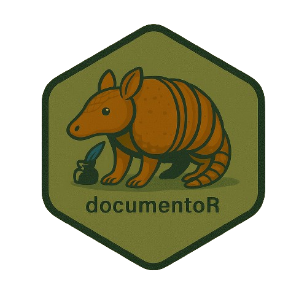

# documentoR <a href="https://github.com/MDRCNY/documentoR"></a>

AI-assisted documentation for R projects — scan a project, summarize each file using an LLM (e.g. via **ellmer**), and generate machine- and human-friendly documentation (per-file markdown, `index.json` and/or a single combined `documentation.md` plus an auto-generated `README.md`).

> Designed for fast, repeatable project documentation using LLMs. Works well for R packages, analysis repos, data notebooks, and mixed-format docs.

---

## Table of contents

- [Purpose](#purpose)  
- [Highlights](#highlights)  
- [Quick start](#quick-start)  
- [What gets documented (defaults)](#what-gets-documented-defaults)  
- [Main functions (supported)](#main-functions-supported)  
- [Exclude file format (`exclude.txt`)](#exclude-file-format-excludetxt)  
- [File handlers & extensibility](#file-handlers--extensibility)  
- [Tips & caveats](#tips--caveats)  
- [Suggested workflow / best practice](#suggested-workflow--best-practice)  
- [Contributing & License](#contributing--license)

---

## Purpose

`documentoR` automates the boring part of documentation: reading through a repository's files and producing concise, actionable summaries for each file using an LLM chat function. It helps you quickly:

- Understand what’s in a repo (code, data, docs, notebooks, PDFs).
- Produce a single human-readable `documentation.md` that teams can review.
- Create a short `README.md` summarizing the project using the extracted `SUMMARY` sections.
- Keep an `index.json` mapping each file to its generated summary (for tooling or search).

The package is intentionally small and opinionated — it gives a reproducible starting point and lets you plug in better handlers and LLM backends as you want.

---

## Highlights

- Scan a folder and summarize supported files via a user-supplied `chat_fn(prompt)` (LLM wrapper).
- Optionally produce per-file `.md` files in `documentation/` and an `index.json`.
- Optionally create a single combined `documentation/documentation.md`.
- Optionally generate/overwrite `README.md` based on extracted `SUMMARY` sections.
- Dry-run mode to preview what would be processed without calling any LLM or writing files.
- `make_ellmer_chat_fn()` helper to wrap `ellmer` chat objects.

---

## Quick start

Uncomment and copy the sequence below into your R session (run from package source root or after `devtools::load_all()` when developing). This exactly matches the demo flow we discussed.

```r
# 0) load package (run from package source root)
devtools::load_all()

# 1) quick dry-run using the tiny stub chat (no LLM calls; shows which files would be summarized)
chat_fn <- documentoR::stub_chat

documentoR::document_project_single_file(
  path = "docs",                                 # folder to scan
  chat_fn = chat_fn,                             # stub chat (no external LLM)
  output_file = "documentation/documentation.md",# where to write combined doc (relative to output_base)
  output_base = getwd(),                         # base used to resolve output_file and README (defaults to getwd())
  dry_run = TRUE,                                # only list files, do not call LLM or write files
  verbose = TRUE
)
```

```r
# 2) Real run with stub chat: writes a combined documentation file + README at output_base
documentoR::document_project_single_file(
  path = "docs",
  chat_fn = chat_fn,
  output_file = "documentation/documentation.md",
  output_base = getwd(),
  dry_run = FALSE,            # actually call chat_fn for each file
  generate_readme = TRUE,     # also create README.md (at output_base)
  overwrite_readme = TRUE,    # overwrite existing README if present
  verbose = TRUE
)
```

```r
# 3) Use a real LLM via ellmer (uncommented); configure ellmer/credentials before running.
#    This example creates an ellmer chat object and wraps it for documentoR.
chat <- ellmer::chat_aws_bedrock(
  model = "anthropic.claude-3-5-sonnet-20240620-v1:0",
  system_prompt = "Answer concisely and use prior context."
)

chat_fn_llm <- documentoR::make_ellmer_chat_fn(chat)

# Run documentoR using the ellmer-backed chat function
documentoR::document_project_single_file(
  path = "docs",
  chat_fn = chat_fn_llm,
  output_file = "documentation/documentation.md",
  output_base = getwd(),      # resolves output_file/README relative to current working dir
  dry_run = FALSE,
  generate_readme = TRUE,
  overwrite_readme = TRUE,
  verbose = TRUE
)
```

---

## What gets documented (defaults)

By default `documentoR` scans the provided `path` (recursively) and includes these common extensions (case-insensitive):

```
R, r, Rmd, rmd, qmd, qmarkdown, md, markdown, html, htm, ipynb, pdf, docx, doc, pptx,
rds, rda, rdata, csv, sql, json, yml, yaml
```

Default excluded directories: `packrat`, `renv`, `node_modules`, `.git`, `demo`  
Default exclude patterns: `\.Rproj$`, `^README\.md$`

Use `exclude.txt` (see below) or function args to customize.

---

## Main functions (supported)

- `scan_project_files(path, include, exclude_dirs, exclude_patterns)` — list matching files.
- `summarize_file(file, chat_fn, max_chars)` — summarize a single file using `chat_fn`.
- `create_single_documentation(summaries, output_file)` — combine per-file summaries into one markdown.
- `create_readme_text_fixed(project_path, file_summaries)` — build README.md content from `SUMMARY` sections.
- `document_project()` — full orchestration (index.json, per-file md, single output).
- `document_project_single_file()` — convenience wrapper to create *one* combined documentation file + optional README.
- `make_ellmer_chat_fn(chat_obj)` — helper to wrap ellmer chat objects.
- `stub_chat()` — tiny stub for dry runs and testing.

---

## Exclude file format (`exclude.txt`)

Place `documentation/exclude.txt` or provide a path via `exclude_file`. Lines support:

- directory names (one per line), e.g. `demo`
- directory globs ending with `/` e.g. `data/`
- filename/glob patterns like `*.log`, `docs/*.pdf`
- comments starting with `#` and blank lines ignored

---

## File handlers & extensibility

`documentoR` can call `choose_handler_for_file(path)` if you provide `R/file_handlers.R` inside the package. Handlers can:

- Extract plain text from PDFs, Word docs, PowerPoints, Jupyter notebooks.
- Produce a `content` string and `meta` list (size, mtime).
- Return `NULL` to fall back to naive text reading.

Suggested packages for handlers: `pdftools`, `textreadr`, `xml2`, `rvest`, `magick`.

---

## Tips & caveats

- LLM prompts include truncated file content (default 16k chars). Adjust with `max_chars`.
- Use `dry_run = TRUE` to confirm files before incurring LLM calls / costs.
- For large repos, use `change_only = TRUE` (where supported) to reuse unchanged summaries.
- The README generator extracts the `SUMMARY` section from each file's generated markdown — ensure your LLM output follows the template.

---


